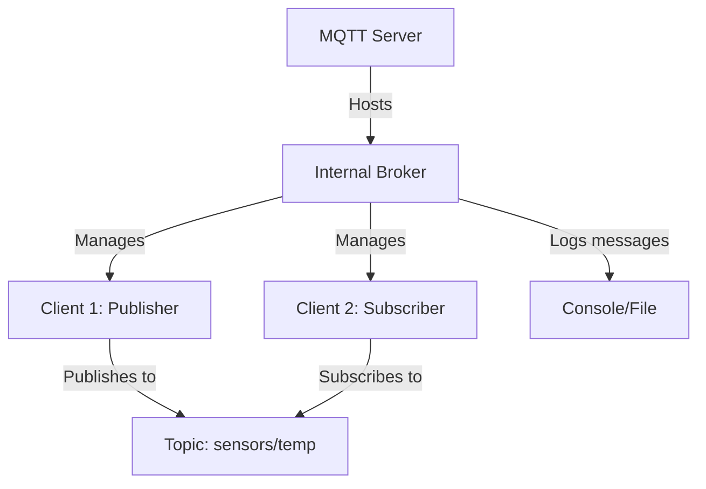
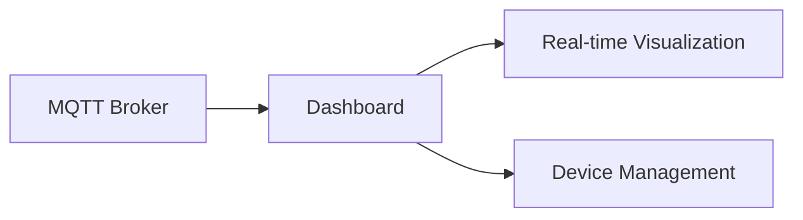

# Python-based MQTT Server with Internal Broker

## Introduction

### Project Goals
This project implements a standalone MQTT server using Python 3.12.9 that hosts an **internal MQTT broker**, eliminating the need for external broker software like Mosquitto. The solution handles client connections, message routing, and real-time message logging with full Python 3.12 compatibility.

### Role of MQTT in IoT Systems
MQTT (Message Queuing Telemetry Transport) is a lightweight publish-subscribe protocol ideal for IoT applications due to:
- Low bandwidth consumption
- Efficient data distribution
- Support for unreliable networks
- Decoupled architecture between data producers and consumers

### Why Use an Internal Broker?
- **No external dependencies**: Self-contained operation without installing/configuring separate broker software
- **Customization**: Full control over broker behavior and extensions
- **Development efficiency**: Simplified debugging and testing
- **Resource efficiency**: Lower overhead for small-scale deployments
- **Python-native**: Seamless integration with Python applications and data processing pipelines

## Foundational Theory

### Core Concepts
- **MQTT Broker**: Message router that manages client connections, topic subscriptions, and message distribution
- **MQTT Client**: Devices/applications that publish messages or subscribe to topics
- **Topics**: Hierarchical channels (e.g., `sensors/temperature/room1`) for message categorization

### Internal Broker Workflow
1. Server initializes an embedded MQTT broker
2. Clients connect to the broker using TCP
3. Publishers send messages to specific topics
4. Broker routes messages to all subscribers of matching topics
5. Server processes messages internally without external services

### System Architecture


## Environment Installation (Anaconda 3.12.9)

### Environment Setup
1. Install [Anaconda](https://www.anaconda.com/download)
2. Create a new environment:
```bash
conda create -n mqtt_env python=3.12.9
conda activate mqtt_env
```

### Install Required Packages
```bash
pip install amqtt paho-mqtt
```

### Project Structure
```
mqtt_project/
├── server.py        # Main server with internal broker
├── client.py        # Test client script
└── README.md        # This documentation
```

## Source Code Breakdown

### Key Components (`server.py`)

#### 1. Broker Configuration
```python
config = {
    'listeners': {
        'default': {
            'type': 'tcp',
            'bind': '0.0.0.0:1883',  # Listen on all interfaces
            'max_connections': 10
        }
    },
    'sys_interval': 10,
    'topic-check': {
        'enabled': False  # Allow all topics
    }
}
```

#### 2. Broker Initialization and Startup
```python
async def start_broker():
    broker = Broker(config)
    await broker.start()
    print("[SERVER] Internal MQTT broker started at 0.0.0.0:1883")
    return broker
```

#### 3. Message Logging and Processing
```python
async def message_logger():
    client = MQTTClient()
    await client.connect('mqtt://localhost:1883')
    await client.subscribe([('#', 0)])  # Subscribe to all topics
    
    while True:
        message = await client.deliver_message()
        packet = message.publish_packet
        payload = packet.payload.data.decode()
        print(f"\n[MSG] Topic: {packet.variable_header.topic_name}")
        print(f"Payload: {payload}")
```

#### 4. Graceful Shutdown
```python
async def shutdown(broker):
    await broker.shutdown()
    print("\n[SERVER] Broker stopped")
```

#### 5. Main Event Loop Management
```python
if __name__ == "__main__":
    loop = asyncio.new_event_loop()
    asyncio.set_event_loop(loop)
    
    try:
        loop.run_until_complete(main())
    except KeyboardInterrupt:
        print("\n[SERVER] Keyboard interrupt received")
    finally:
        loop.close()
        print("[SERVER] Event loop closed")
```

## Demo MQTT Client

### Client Implementation (`client.py`)

#### Connection Handling
```python
def on_connect(client, userdata, flags, rc):
    if rc == 0:
        print("[CLIENT] Connected successfully")
        client.publish("system/status", "Client online")
    else:
        print(f"[CLIENT] Connection failed with code {rc}")

client = mqtt.Client()
client.on_connect = on_connect
client.connect("localhost", 1883, 60)
client.loop_start()
```

#### Data Publishing
```python
try:
    while True:
        temp = round(20 + random.random() * 10, 1)
        humidity = random.randint(30, 70)
        
        client.publish("sensors/temperature", f"{temp}°C")
        client.publish("sensors/humidity", f"{humidity}%")
        client.publish("device/status", "operational")
        
        print(f"[CLIENT] Published: temp={temp}°C, humidity={humidity}%")
        time.sleep(5)
```

### Testing Procedure
1. **Start the server**:
```bash
python server.py
```
Output:
```
[SERVER] Internal MQTT broker started at 0.0.0.0:1883
[SERVER] Message logger active. Press Ctrl+C to exit.
```

2. **Run the client**:
```bash
python client.py
```
Output:
```
[CLIENT] Publishing test data. Press Ctrl+C to stop.
[CLIENT] Connected successfully
[CLIENT] Published: temp=24.3°C, humidity=45%
```

3. **Server output**:
```
[MSG] Topic: system/status
Payload: Client online

[MSG] Topic: sensors/temperature
Payload: 24.3°C

[MSG] Topic: sensors/humidity
Payload: 45%
```

## Evaluation and Development

### Advantages
- **Self-contained**: No external dependencies
- **Modern stack**: Python 3.12 + AMQTT compatibility
- **Asynchronous design**: Efficient handling of multiple clients
- **Simple configuration**: Easy to customize for different use cases

### Limitations
- Scalability constraints for large deployments
- Limited built-in security features
- Requires Python 3.7+ and async programming knowledge

### Enhancement Opportunities

#### Real-time Dashboard


#### Data Persistence
```python
# Example database logging
async def save_to_db(topic, payload):
    with sqlite3.connect('mqtt_data.db') as conn:
        cursor = conn.cursor()
        cursor.execute('INSERT INTO messages VALUES (?,?,?)', 
                      (datetime.now(), topic, payload))
```

#### Security Enhancements
1. Implement TLS encryption:
```python
'listeners': {
    'tls': {
        'bind': '0.0.0.0:8883',
        'ssl': True,
        'certfile': 'server.crt',
        'keyfile': 'server.key'
    }
}
```
2. Add client authentication:
```yaml
auth:
  allow-anonymous: false
  password-file: /path/to/passwd
```

#### Multi-Protocol Support
- Add WebSocket endpoint
- Implement HTTP/HTTPS bridge
- Support CoAP protocol

## Source Code

### server.py
```python
import asyncio
from amqtt.broker import Broker
from amqtt.client import MQTTClient

config = {
    'listeners': {
        'default': {
            'type': 'tcp',
            'bind': '0.0.0.0:1883',
            'max_connections': 10
        }
    },
    'sys_interval': 10,
    'topic-check': {
        'enabled': False
    }
}

async def start_broker():
    broker = Broker(config)
    await broker.start()
    print("[SERVER] Internal MQTT broker started at 0.0.0.0:1883")
    return broker

async def message_logger():
    client = MQTTClient()
    await client.connect('mqtt://localhost:1883')
    await client.subscribe([('#', 0)])
    
    print("[SERVER] Message logger active. Press Ctrl+C to exit.")
    while True:
        try:
            message = await client.deliver_message()
            packet = message.publish_packet
            payload = packet.payload.data.decode()
            print(f"\n[MSG] Topic: {packet.variable_header.topic_name}")
            print(f"Payload: {payload}")
        except Exception as e:
            print(f"[ERROR] Message handling: {e}")
            break

async def shutdown(broker):
    await broker.shutdown()
    print("\n[SERVER] Broker stopped")

async def main():
    broker = await start_broker()
    try:
        await message_logger()
    except asyncio.CancelledError:
        pass
    finally:
        await shutdown(broker)

if __name__ == "__main__":
    loop = asyncio.new_event_loop()
    asyncio.set_event_loop(loop)
    
    try:
        loop.run_until_complete(main())
    except KeyboardInterrupt:
        print("\n[SERVER] Keyboard interrupt received")
    finally:
        loop.close()
        print("[SERVER] Event loop closed")
```

### client.py
```python
import paho.mqtt.client as mqtt
import time
import random

def on_connect(client, userdata, flags, rc):
    if rc == 0:
        print("[CLIENT] Connected successfully")
        client.publish("system/status", "Client online")
    else:
        print(f"[CLIENT] Connection failed with code {rc}")

client = mqtt.Client()
client.on_connect = on_connect
client.connect("localhost", 1883, 60)
client.loop_start()

print("[CLIENT] Publishing test data. Press Ctrl+C to stop.")
try:
    while True:
        temp = round(20 + random.random() * 10, 1)
        humidity = random.randint(30, 70)
        
        client.publish("sensors/temperature", f"{temp}°C")
        client.publish("sensors/humidity", f"{humidity}%")
        client.publish("device/status", "operational")
        
        print(f"[CLIENT] Published: temp={temp}°C, humidity={humidity}%")
        time.sleep(5)
        
except KeyboardInterrupt:
    client.publish("system/status", "Client offline")
    client.disconnect()
    print("\n[CLIENT] Disconnected")
```
