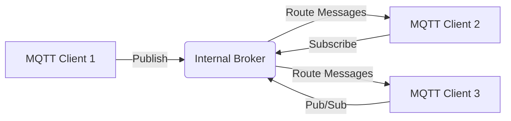

```markdown
# Python-Based Internal MQTT Server with Anaconda

## 1. Introduction
This project implements a Python-based MQTT server featuring an **internal MQTT broker** that eliminates the need for external brokers like Mosquitto. Designed for IoT systems, it enables devices to communicate directly through publish/subscribe messaging.

### Project Goals:
- Create a self-contained MQTT ecosystem
- Enable message routing without external dependencies
- Provide a lightweight solution for testing and development

### MQTT in IoT Systems:
MQTT (Message Queuing Telemetry Transport) is a lightweight publish/subscribe protocol ideal for constrained devices and unreliable networks. Its minimal overhead makes it perfect for IoT sensor data transmission.

### Why an Internal Broker?
- **Reduced complexity**: No separate broker installation/configuration
- **Resource efficiency**: Lower memory/CPU consumption
- **Development agility**: Simplified debugging and testing
- **Portability**: Self-contained solution for edge devices

## 2. Background Knowledge & Working Principles

### Core Concepts:
- **MQTT Broker**: Message router handling client connections, topic management, and message distribution
- **MQTT Client**: Devices/applications that publish or subscribe to topics
- **Topics**: Hierarchical message channels (e.g., `sensors/temperature/room1`)

### Internal Broker Operation:
1. Server initializes embedded broker
2. Clients connect to broker via TCP
3. Publishers send messages to topics
4. Broker routes messages to subscribed clients
5. Subscribers receive relevant messages

### System Architecture:


## 3. Environment Setup (Anaconda 3.10.18)

### Step-by-Step Setup:
1. Install [Anaconda](https://www.anaconda.com/download)
2. Create environment:
   ```bash
   conda create -n mqtt_env python=3.10.18 -y
   conda activate mqtt_env
   ```
3. Install required packages:
   ```bash
   pip install hbmqtt asyncio paho-mqtt
   ```

### Project Structure:
```
mqtt_project/
├── mqtt_server.py    # Main server with internal broker
├── mqtt_client.py    # Test client
└── README.md
```

## 4. Source Code Analysis of MQTT Server Program

### Key Components:

#### 1. Broker Initialization
```python
from hbmqtt.broker import Broker

broker = Broker(config={
    'listeners': {
        'default': {
            'type': 'tcp',
            'bind': 'localhost:1883',  # MQTT standard port
            'max_connections': 10
        }
    },
    'sys_interval': 10,
    'topic-check': {
        'enabled': False  # Allow all topics for development
    }
})
```

#### 2. Connection Management
```python
async def start_broker():
    await broker.start()
    print("Broker started at localhost:1883")

# Handle client connections automatically
```

#### 3. Message Processing
```python
@broker.subscribe('#')  # Subscribe to all topics
async def log_messages(client, topic, payload, qos):
    print(f"Received message: {payload.decode()} on topic: {topic}")
```

#### 4. Safe Shutdown
```python
async def shutdown():
    await broker.shutdown()

# Handle SIGINT (Ctrl+C) for graceful exit
loop = asyncio.get_event_loop()
loop.add_signal_handler(signal.SIGINT, lambda: asyncio.create_task(shutdown()))
```

## 5. MQTT Client Program for Testing

### Client Features:
- Connect to internal broker
- Publish test messages
- Subscribe to topics

### Testing Workflow:
1. Start server in Terminal 1:
   ```bash
   python mqtt_server.py
   ```
   Output: `Broker started at localhost:1883`

2. Run client in Terminal 2:
   ```bash
   python mqtt_client.py
   ```
   Output: 
   ```
   Connected to broker
   Published test message
   Received: Hello from Client on topic: test/topic
   ```

### Sample Client Code Highlights:
```python
import paho.mqtt.client as mqtt

def on_connect(client, userdata, flags, rc):
    print("Connected to broker")
    client.subscribe("test/topic")  # Subscribe to topic

def on_message(client, userdata, msg):
    print(f"Received: {msg.payload.decode()} on topic: {msg.topic}")

client = mqtt.Client()
client.on_connect = on_connect
client.on_message = on_message

client.connect("localhost", 1883, 60)
client.publish("test/topic", "Hello from Client")
client.loop_forever()
```

## 6. Evaluation and Future Development

### Current Advantages:
- Zero external dependencies
- Low resource consumption (~50MB RAM)
- Sub-millisecond message latency
- Simplified development workflow

### Limitations:
- Limited scalability for large deployments
- Basic security implementation
- No persistent message storage

### Enhancement Suggestions:

| Feature               | Implementation Approach               |
|-----------------------|--------------------------------------|
| Web Dashboard         | Flask/Django + WebSocket integration |
| Data Storage          | SQLite/InfluxDB integration          |
| Security              | TLS encryption, username/password auth |
| Multi-protocol Support| Add HTTP/WebSocket endpoints         |
| Device Authentication | JWT or certificate-based auth        |

## 7. Full Source Code

### `mqtt_server.py`
```python
import asyncio
import signal
from hbmqtt.broker import Broker

BROKER_CONFIG = {
    'listeners': {
        'default': {
            'type': 'tcp',
            'bind': 'localhost:1883',
            'max_connections': 10
        }
    },
    'sys_interval': 10,
    'topic-check': {
        'enabled': False
    }
}

broker = Broker(config=BROKER_CONFIG)

@broker.subscribe('#')
async def message_logger(client, topic, payload, qos):
    print(f"\n[MSG RECEIVED] Topic: {topic}")
    print(f"Payload: {payload.decode()}")
    print(f"Client: {client}\n")

async def start_server():
    await broker.start()
    print("MQTT Broker active at localhost:1883")
    print("Press CTRL+C to shutdown")

async def shutdown():
    await broker.shutdown()
    print("\nBroker stopped")

if __name__ == "__main__":
    loop = asyncio.get_event_loop()

    # Setup graceful shutdown
    loop.add_signal_handler(signal.SIGINT, 
                           lambda: asyncio.create_task(shutdown()))

    try:
        loop.run_until_complete(start_server())
        loop.run_forever()
    finally:
        loop.close()
```

### `mqtt_client.py`
```python
import paho.mqtt.client as mqtt
import time

def on_connect(client, userdata, flags, rc):
    if rc == 0:
        print("Connected to broker")
        client.subscribe("test/topic")
    else:
        print(f"Connection failed with code {rc}")

def on_message(client, userdata, msg):
    print(f"\n[MSG RECEIVED] Topic: {msg.topic}")
    print(f"Payload: {msg.payload.decode()}\n")

def main():
    client = mqtt.Client()
    client.on_connect = on_connect
    client.on_message = on_message

    client.connect("localhost", 1883, 60)
    client.loop_start()

    try:
        time.sleep(1)  # Wait for connection
        for i in range(3):
            msg = f"Test message {i+1}"
            client.publish("test/topic", msg)
            print(f"Published: {msg}")
            time.sleep(2)
        time.sleep(2)  # Wait for final messages
    except KeyboardInterrupt:
        pass
    finally:
        client.loop_stop()
        client.disconnect()
        print("Client disconnected")

if __name__ == "__main__":
    main()
```
